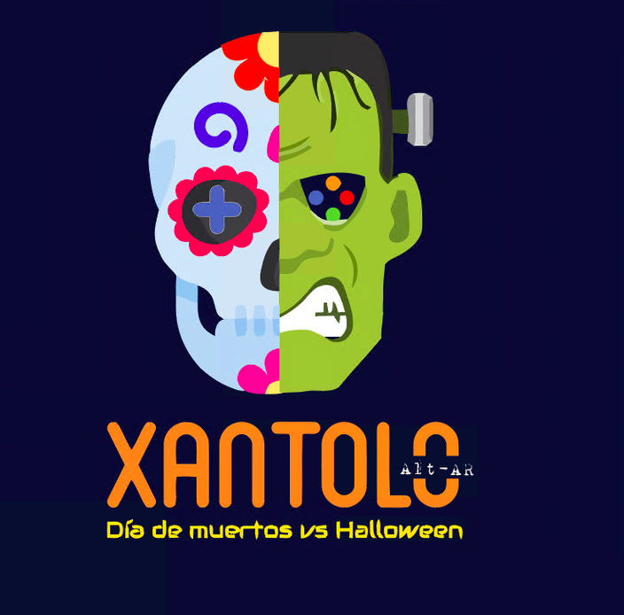

# Xantolo Alt-AR

Solución para el hackaton de vertical de Nube en el programa de Innovaccion. Consiste de un juego en realidades extendidas en donde tu misión, si decides aceptarla, será proteger la ofrenda del día de muertos de los mounstruos de halloween que quieren destruirla, a la vez que ayudas a tus seres queridos a llegar a la misma. Aparte de las realidades extendidas esta aplicación hace uso de speech recognitios y visual recognition, ambos servicios cognitivos de azure, es decir que, debes de atacar a tu enemigo con comandos de voz, mediante la recitación de una calaverita o tomando una foto a un elemento de la tradición y obteniendo armas, las cuales son mismos componentes del altar de muertos.

Este videojuego se conecta a los servicios cognitivos de Azure de speech recognition y computer visión para que obtengas armas y ataques a los enemigos.

Se tiene pensado que funcione con tecnologías Microsoft como Hololens para aprovechar la tecnología de realidad mixta, los sensores y receptores de audio, así como la camara para funciones avanzadas de reconocimiento y detección de imagenes y patrones.

Nos cambiaron las tecnologías que debiamos usar(IoS y API .Net) por tecnologías 100% Microsoft, lo cual fue un gran reto ya que debimos configurar todo el entorno, aprovisionando una maquina virtual y seteando todo el ambiente, instalando dependencias y recursos necesarios desde cero.

En la parte de diseño. planteamiento y propuesta de la idea tuvimos que enfrentar retos de comunicación, disponibilidad y trabajo en equipo, pero aprendimos los unos de los otros y logramos fromar un buen equipo de trabajo.

Participantes y experiencia--> 
-José Luis Jiménez Landa
viajero13279@innovaccion.mx

Mi experiencia: Fue un hackaton muy especial y que me dejo mucho aprendizaje, ya que fue totalmente en linea, sin interacción física y sin conocer previamente a los integrantes del equipo, sin embargo nos organizamos tuvimos algunas juntas por meetings donde nos conocimos, delegamos trabajo y nos sincronizamos para poder todos colaborar desde nuestra experiencia, conocimientos y hábilidades. Agradezco mucho a todos por su compromiso, determinación, ideas y trabajo que hicieron que esta idea fuera más alla de su concepción. Independientemente del resultado, si pasamos o no, si ganamos o no, me quedo con la experiencia, lo aprendido y si me lo permiten su contacto y amistad. Gracias por todo, saludos y éxito.

-Carolina González Guerrero
viajero08598@innovaccion.mx

-Atzin Azael Solís Aguilar
viajero28272@innovaccion.mx

-Alicia Dalina Avilés Rosales
viajero34315@innovaccion.mx 

-José Lizandro Kú Vázquez
viajero00393@innovaccion.mx  

